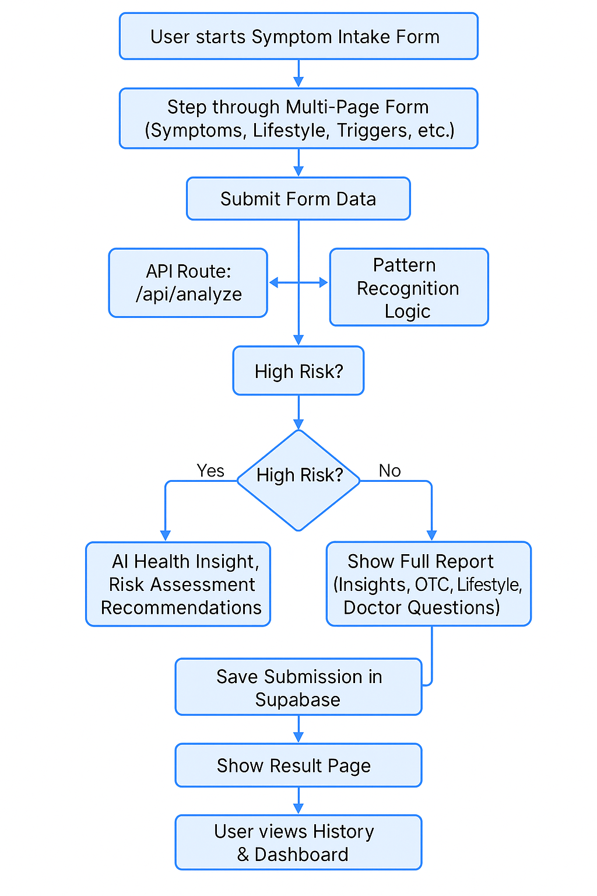

# DigestAI

DigestAI is an AI-powered gut health assistant. It guides users through a structured, multi-step symptom intake form, analyzes their data using advanced AI and pattern recognition, and provides personalized health insights, risk assessment, and actionable recommendations—all in a user-friendly web application.

---

## Features

- **Multi-Page Symptom Intake Form:**  
  Collects symptoms, duration, conditions, diet & lifestyle, stress, triggers, and more.

- **AI-Powered Health Insights:**  
  Uses OpenAI to analyze user input and generate an easy-to-read health report with:
  - Risk summary (Low/Medium/High)
  - Contributing factors
  - Lifestyle/OTC advice
  - Suggested doctor questions

- **Pattern Recognition:**  
  Detects trends, repeat triggers, and symptom clusters across single and historical submissions.

- **Safety-first Logic:**  
  High-risk cases show only a risk alert, summary, and disclaimer—no self-care advice.

- **Submission History & Dashboard:**  
  Visualizes previous reports with badges, trend charts, and confidence scores.

- **Doctor-Friendly PDF Export:**  
  Download a full report for medical consultations.

---

## System Flow

---

## Tech Stack

- **Frontend:** Next.js (App Router), React, TypeScript, Tailwind CSS, Shadcn UI  
- **AI:** OpenAI GPT-4 Turbo  
- **Pattern Recognition:** Custom logic  
- **Authentication:** Clerk  
- **Database:** Supabase (PostgreSQL)  

---

